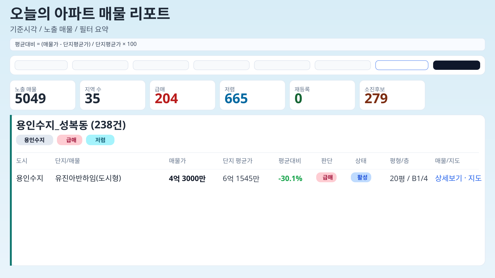

# apt-price-tracker

네이버 모바일 부동산(`m.land.naver.com`) 매물을 수집해 `data/apt-listings.json`으로 관리하고,
웹 리포트(GitHub Pages) + Teams 카드로 요약 알림을 보내는 배치 프로젝트입니다.



## 라이브 리포트

- 웹 주소: [https://saechimdaeki.github.io/apt-price-tracker/](https://saechimdaeki.github.io/apt-price-tracker/)

## 핵심 기능

- 대상 지역(현재 50개 동) 순회 수집
- 20~39평 매물만 저장
- 매물 상태 라이프사이클 관리
  - `ACTIVE` (활성)
  - `OFF_MARKET_CANDIDATE` (소진후보)
  - `OFF_MARKET` (소진추정)
  - `RELISTED` (재등록)
- 가격 신호 분류
  - 급매: 평균 대비 `-10%` 이하
  - 저렴: 평균 대비 `-5%` 이하
- GitHub Pages 리포트 자동 배포
- Teams 1회 요약 카드 + 리포트 링크 전송

## 매물 상태 처리 규칙

- 이번 실행에서 **성공한 지역** 기준으로만 상태 전환
- 미노출 1~N회 누적 시 `OFF_MARKET_CANDIDATE` → 임계치 도달 시 `OFF_MARKET`
- `OFF_MARKET` 매물이 다시 보이면 `RELISTED`
- 지역 수집 중 차단/실패가 나면 해당 지역 데이터는 이번 회차 상태 전환에서 제외

## 리포트 계산 기준

- 단지 평균가: 같은 단지(지역 + 단지키)의 현재 노출 매물 평균
- 평균대비(%): `(매물가 - 단지평균가) / 단지평균가 * 100`
- 리포트 표에는 `ACTIVE`, `RELISTED`만 노출

## 실행 구조

### 1) 수집 워크플로우

파일: `.github/workflows/apt-price-bot.yml`

- 평일 KST 오전 9시 자동 실행 (`cron`)
- 수동 실행 가능 (`workflow_dispatch`)
- 실행 후 `data/apt-listings.json` 변경 시 자동 커밋

### 2) 리포트/알림 워크플로우

파일: `.github/workflows/send-teams-from-json.yml`

- `run` 워크플로우 성공 후 자동 실행
- `pages/index.html` 생성 후 GitHub Pages 배포
- Teams에 요약 카드 1건 전송 (웹 리포트 링크 포함)

## 필요한 설정

### GitHub Secrets

- `TEAMS_WEBHOOK_URL`: Power Automate/Teams Webhook URL

### GitHub Pages

- Repository Settings → Pages → Source: **GitHub Actions**

## 주요 설정값

파일: `src/main/resources/application.yml`

- `bot.safe.max-regions-per-run`: 기본 `50`
- `bot.market.off-market-confirm-miss-count`: 소진추정 전환 임계치
- `naver.safe.abuse-cooldown-minutes`: abuse 감지 후 쿨다운(기본 `30`분)
- `naver.safe.request-timeout-ms`: 요청 타임아웃
- `naver.safe.max-complexes-per-region`: 지역별 단지 수집 상한

## 로컬 실행

```bash
./gradlew clean bootRun
```

테스트:

```bash
./gradlew test
```

## Self-hosted Runner

현재 워크플로우 러너:

```yaml
runs-on: [self-hosted, macOS, ARM64]
```

러너 상태 관리:

```bash
cd ~/actions-runner/apt-price-tracker-runner
./svc.sh status
./svc.sh start
./svc.sh stop
```
